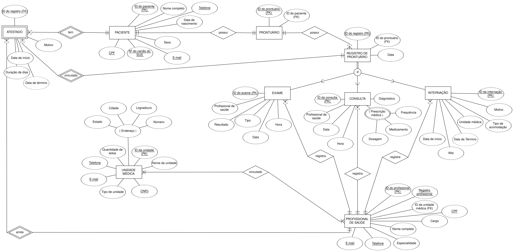
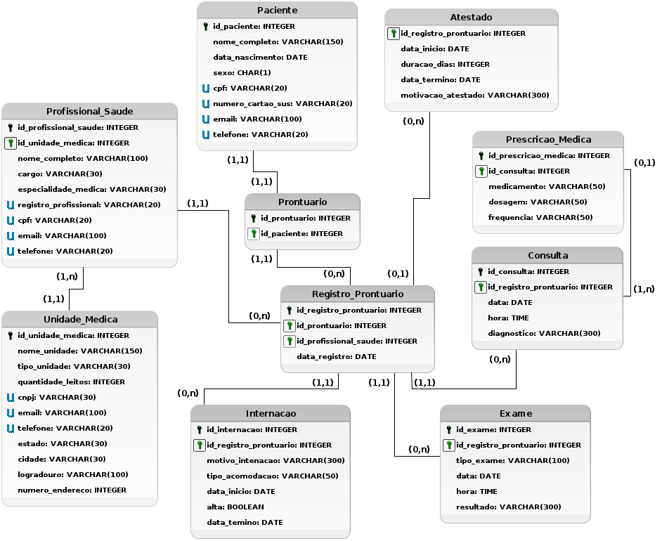

# Conexão-BD-ProntaSaúde
Este projeto é parte do trabalho da disciplina de **Fundamento de Banco de Dados**, ministrada pela professora **Livia Almada**. Nesta entrega, focamos no acesso ao banco de dados através de uma aplicação utilizando **Jupyter Notebooks**. Isso permite realizar consultas, inserções e atualizações no banco de dados de forma prática e interativa.

### Sobre o projeto (ProntaSaúde)
O **ProntaSaúde** oferece uma solução definitiva para as limitações dos prontuários em papel, como o acesso lento e a insegurança dos dados. O sistema armazena todas as informações de consultas, exames, internações e prescrições médicas, garantindo acesso imediato e seguro aos profissionais autorizados. 

O objetivo do projeto é desenvolver um sistema mais eficiente, seguro, organizado e, acima de tudo, centrado no paciente.

### Diagrama Conceitual
A seguir, as entidades, atributos e ralacionamentos do sistema serão representados em um diagrama conceitual ER/EER.

  

### Diagrama Lógico
A seguir, apresentamos o diagrama lógico da aplicação. Nele, podemos encontrar tabelas como Paciente, Prontuário, Registro de Prontuário, Consulta, Exame, Internação, Atestado, Unidade Médica e Profissional de Saúde, além da tabela auxiliar Prescrição Médica. As relações entre essas entidades são definidas pelas chaves primárias e estrangeiras.

  

<h3 align="center">Equipe</h3>

Amâncio José de Lima Neto - 493628

Wania Kelly dos Santos Oliveira - 540491

